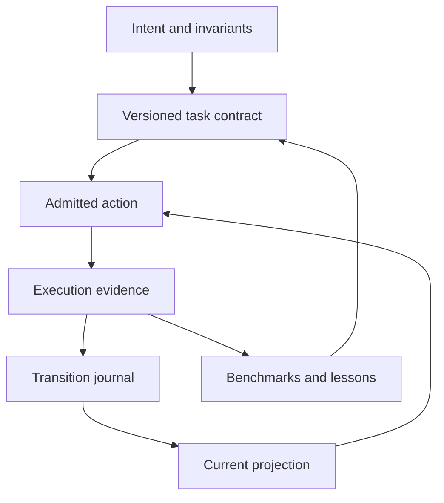

# Agent operating model

## Purpose

An agent should be able to enter this repository without conversation history,
identify what is established, locate the next useful action, perform it within
a declared budget, and leave evidence that another agent can replay. The user
has delegated implementation and publication. Accuracy and resource economy
take precedence over apparent activity.

The current repository has a pinned Bend overlay, eight finite repair laws,
an external repair-report validator, diagnostic experiments, and a supervised
proof-simplification campaign. These remain useful. The missing connection is
an executable account of what each result establishes and what can happen next.

## Alternatives and decision

More Markdown would be cheap to add but would leave reconciliation to each
agent. A remote orchestration service would centralize execution but introduce
credentials, deployment, uptime, and another mutable authority. A local control
interface can enforce the important relationships with Python's standard
library and ordinary Git. We choose that interface. Remote workers are a later
adapter, gated on measured demand and real isolation.

## The linked abstractions

| Level | Meaning | Authority | Question answered |
| --- | --- | --- | --- |
| Intent | Required outcome, invariants, non-goals | This reviewed design and user instructions | What counts as useful? |
| Contract | Task IDs, dependencies, source scope, checks, budgets | `system/roadmap.json` | What can establish completion? |
| History | Ordered transitions with request IDs and parent hashes | `state/events.jsonl` | What was actually decided? |
| Evidence | Command, exit, raw output, source hashes, environment | `evidence/agent-system/` | Why is a decision supported? |
| Projection | Current effective status, readiness, blockers | Deterministic replay plus evidence freshness | What is true now? |
| Action | Smallest ready task and exact check command | `control.py next` and `explain` | What should I inspect or do? |
| Learning | Reproductions, limits, guards, measured outcomes | Evidence-backed lessons and metric history | What changes the next attempt? |

Feedback into the contract is a reviewed version change. A candidate cannot
change its evaluator during a campaign and preserve the old comparison.

## Invariants

1. `bend2/bend.ts` and the existing repair laws do not change in this work.
2. A valid journal is replayable without trusting a summary or previous chat.
3. A repeated request ID with identical payload returns the original event.
   Reusing the ID for different content is an error.
4. A writer supplies the current head hash. A stale writer makes no change.
5. SOLVED requires successful retained verification of the declared source
   scope. Missing or changed evidence makes the effective state STALE.
6. A dependency becoming stale makes its completed dependents stale. History
   is retained; a projection cannot rewrite a past observation.
7. BLOCKED and UNRESOLVED require a concrete reason and reopen condition.
8. A failed measurement cannot become zero cost or a successful observation.
9. Measurements carry suite, source, environment, and metric identities.
10. Read commands do not initialize state or execute tools behind the scenes.

## Commands and boundaries

`python3 control.py status` returns a compact versioned JSON envelope with the
journal head, task counts, effective statuses, and next action. `next` returns
one ready task, its reason, minimal file set, and acceptance commands. `explain
TASK` returns the complete task contract. `doctor` reports actual capability
probes separately from advertised requirements.

`transition TASK STATUS --request ID --head HASH` is the only task-state
mutation. `verify TASK --run-id ID` runs only the task's declared argv arrays,
retains raw evidence, and does not automatically mark the task complete.
`check` validates the plan, journal, and evidence. `benchmark --output PATH`
measures the local control workload and emits targets separately from results.
`todo` renders the current roadmap as Markdown without maintaining a competing
hand-edited status table.

Verification uses a bounded process group, no shell interpolation, a command
timeout, and a retained output limit. It records hashes before and after the
commands. These controls protect against mistakes; this is not a sandbox for
hostile code. The trusted operator still controls the repository and machine.

## Storage and concurrency

The journal is newline-delimited canonical JSON. Each event contains a sequence,
parent digest, plan digest, request ID, payload, and event digest. A POSIX file
lock serializes appends. The writer replays and validates history under the
lock, checks the supplied head, appends one event, flushes, and fsyncs. A torn
tail or tampered record blocks writes; it is never silently discarded.

Plan version 1 is frozen once events exist. Editing it invalidates replay until
a reviewed migration is implemented. The initial backlog therefore includes
future migration as explicit work. Hashes detect accidental corruption; they
are not signatures and cannot defeat an attacker who can rewrite everything.
Git records the journal and evidence for cross-session persistence. Local file
locking does not coordinate concurrent edits across separate Git clones.

## Selection and resource discipline

Ready tasks have satisfied dependencies. Selection is deterministic by priority,
then declared estimated effort, then stable ID. These estimates are scheduling
hints, not measured probabilities. A task marked STALE is reopened explicitly
before another attempt. A blocked task remains visible with its reopen trigger.

The agent reads the status packet, the selected task, and its listed files.
It expands context only to resolve a concrete uncertainty. A candidate needs a
falsifiable hypothesis and a declared objective. Correctness gates precede
performance measurements. A result that cannot change an action should not
trigger another experiment merely to produce more records.

## Accretion

A useful lesson names a failure, its reproducer, the changed operator or guard,
where it applies, and what would invalidate it. We initially retain the existing
stderr diagnostic incident as this format's first example. Prose observations
without an operational consequence stay out of the lesson registry.

Promotion proceeds from observation to reproduction, local guard, reuse on a
different task, and only then a general policy. Negative-transfer tests are
required before widening scope. Future caching keys include source, evaluator,
environment, and objective; a repeated filename is not a valid cache key.

## Benchmarks and interpretation

The registry spans correctness, integrity, reproducibility, context size,
latency, compute budget, research yield, learning transfer, and human burden.
Local deterministic probes establish the initial baseline. Agent success,
token use, model spend, and long-term improvement remain unmeasured until an
instrumented agent trial actually supplies them. Targets are ambitious goals,
not assertions of current capability.

No weighted score permits faster execution to compensate for incorrect
admission. Compare runs only within compatible suite and environment identities.
The roadmap specifies paired trials, held-out tasks, ablation, and confidence
intervals before claiming agent-level benefits or long-term learning.

## Delivery boundary

This change delivers the local control foundation, task/evidence contracts,
first benchmark baseline, operating instructions, atomic backlog, and GitHub
review surface. Remote worker isolation, paid model campaigns, signed evidence,
host branch protection, and cross-clone coordination remain gated roadmap items.
They require different infrastructure or measurement and are not implied by a
successful local test.
